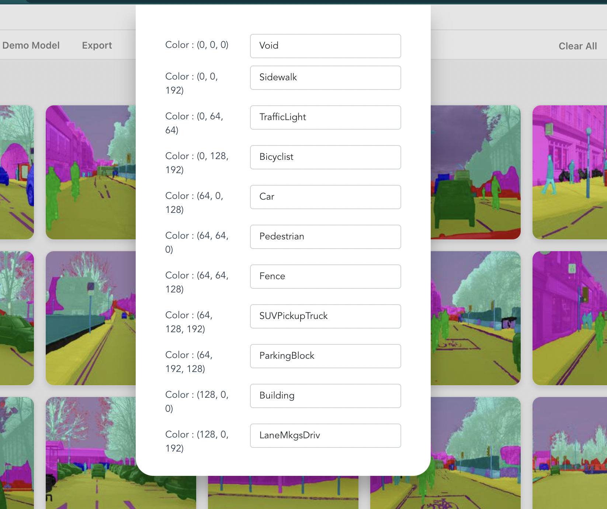

# Instructions for preparing dataset for semantic segmentation

To prepare your dataset for semantic segmentation you need to make two directories :

1) Images

2) Annotations 

Place all your input images in the `Images` folder and all the ground truth annotations in the `Annotations` folder.

Input Image            |  Annotation Image
:-------------------------:|:-------------------------:
  |  

For the annotation images ensure the following 

1) The name of the annotation image should be same as the name of the input image

2) The size of annotation image should exactly match the size of the input image.

3) Each class in the annotation image should be colored with a specific pixel value.

4) The color coding of the classes should be consistant across images. For eg. if the class road is colored as (0,0,5) in one image, then the road pixels should be the same color in all other images. Make sure the the pixel values are exactly same.

5) Make sure the annotation images are in .png format

After preparing the dataset, you can import it into Liner. You will be asked to enter the class name for each pixel value.

After importing the dataset you can start training. 

